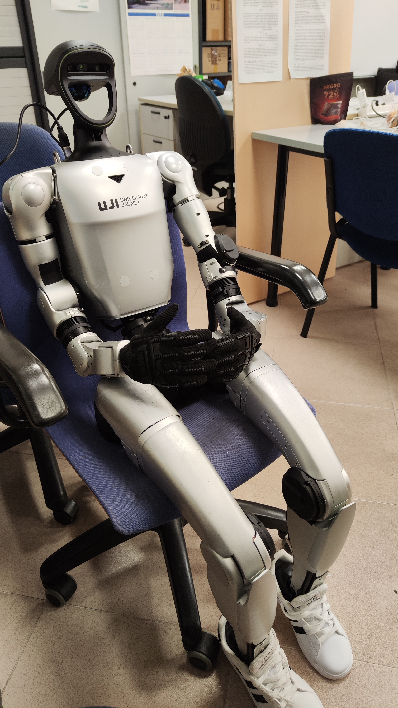

# G1 Unitree Robot Manipulation and Navigation Workspace

This repository contains a ROS 2 workspace for the Unitree G1 humanoid robot. It provides tools, controllers, and scripts for upper-body manipulation, camera streaming, and simulation.



## Repository Structure

- **`camera/`**: Client-server architecture for streaming the G1's internal RealSense and external USB cameras over the network using ZeroMQ.
- **`manipulation/`**: Forward and Inverse Kinematics (FK/IK) controllers, workspace mapping, and computer vision integration for arm manipulation.
- **`fastlio2_exp/`**: Scripts for generating a pointcloud of the environment using a LiDAR and recording ROS 2 topics (Requires Docker).
- **`mujoco/`**: Simulation environment using the Holosoma FastSAC Locomotion Policy for the G1, including camera and teleoperation scripts.
- **`g1_pilot_exp/`**: Guide and configuration for operating the robot wirelessly via Zenoh Bridge without an Ethernet tether.
- **`src/`**: ROS 2 packages including `g1pilot`, `unitree_ros2`, and `livox_ros_driver2`.

## Prerequisites

Before using this workspace, ensure you have the following installed on your local machine:
- **OS:** Ubuntu 22.04 (Recommended)
- **ROS 2:** Humble Hawksbill
- **Python:** 3.10+
- **Unitree SDK2:** Properly installed and sourced in your environment.

## Installation and Setup

To run the scripts natively (without Docker), clone the repository and build the ROS 2 workspace:

```bash
# 1. Source your ROS 2 installation
source /opt/ros/humble/setup.bash

# 2. Navigate to the root of this workspace
cd path/to/robot_ws

# 3. Install dependencies (rosdep)
rosdep update
rosdep install --from-paths src --ignore-src -r -y

# 4. Build the workspace
colcon build

# 5. Source the workspace
source install/setup.bash
```

Please refer to the individual README.md files inside each subdirectory for specific execution instructions.

