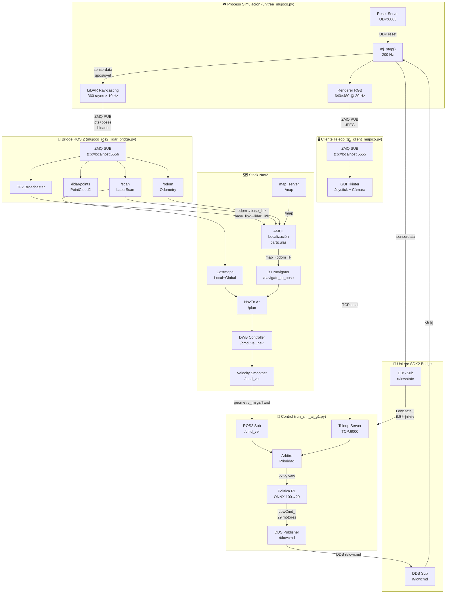

# 🤖 G1 Autonomous Navigation Stack

> **Navegación autónoma completa para el robot humanoide Unitree G1 en simulación MuJoCo + ROS 2 Humble**  
> Desde la física de contacto hasta el planificador de rutas A\*, pasando por SLAM, localización AMCL y control de locomoción por Reinforcement Learning.

---

## Tabla de Contenidos

1. [Visión General y Filosofía](#1-visión-general-y-filosofía)
2. [Arquitectura de Capas (Deep Dive)](#2-arquitectura-de-capas-deep-dive)
3. [El "Sistema Nervioso" — Topics, Puertos y Servicios](#3-el-sistema-nervioso--topics-puertos-y-servicios)
4. [Lógica de Ejecución Paso a Paso](#4-lógica-de-ejecución-paso-a-paso)
5. [Conceptos Avanzados para Expertos](#5-conceptos-avanzados-para-expertos)
6. [Guía de Despliegue](#6-guía-de-despliegue)
7. [Herramientas Auxiliares](#7-herramientas-auxiliares)
8. [Bugs Conocidos y Estado del Proyecto](#8-bugs-conocidos-y-estado-del-proyecto)

---

## 1. Visión General y Filosofía

### El problema

Los robots humanoides son intrínsecamente inestables: 29 grados de libertad, centro de masa alto, y necesidad de mantener el equilibrio dinámico mientras simultáneamente interpretan sensores, planifican rutas y ejecutan comandos de velocidad. Validar un stack de navegación autónoma sobre hardware real tiene un coste enorme (tanto económico como en riesgo de daño al robot). Además, los frameworks de navegación estándar como Nav2 están diseñados para robots con ruedas diferencial, no para humanoides con locomoción omnidireccional.

### La solución técnica elegida

Este proyecto implementa una **arquitectura desacoplada por capas** que resuelve el problema en tres frentes:

1. **Abstracción del hardware**: MuJoCo actúa como gemelo digital del G1. La política de locomoción (un modelo ONNX entrenado por RL — `fastsac_g1_29dof.onnx`) convierte comandos de velocidad `(vx, vy, yaw)` en torques para los 29 motores a 50 Hz. El resto del mundo no sabe —ni necesita saber— que hay un humanoide debajo.

2. **Bridge ZMQ como capa de desacoplamiento**: En lugar de integrar ROS 2 directamente en el bucle de física (lo que añadiría latencia variable e incertidumbre de scheduling), los datos sensoriales (LiDAR 360°, cámara RGB, odometría) se publican vía **ZeroMQ** (patrón PUB/SUB) desde el proceso de simulación. Un nodo ROS 2 independiente consume esos streams y los traduce al ecosistema Nav2. Este diseño mantiene el bucle de física determinista.

3. **Separación de prioridades en el control**: Un árbitro de prioridad explícito garantiza que Nav2 siempre tiene precedencia sobre la teleoperación manual, con un timeout de 500 ms como mecanismo de seguridad ante pérdida de conexión.

```
┌─────────────────────────────────────────────────────────────────────┐
│                        MUNDO REAL / SIMULACIÓN                      │
│  MuJoCo Physics  ←→  Unitree G1 29-DoF  ←→  RL Policy (ONNX)       │
└───────────────────────────────┬─────────────────────────────────────┘
                                │  ZeroMQ PUB/SUB
                                │  (LiDAR @ 5556, RGB @ 5555)
┌───────────────────────────────▼─────────────────────────────────────┐
│                    CAPA DE MIDDLEWARE  (ROS 2 Humble)               │
│  mujoco_ros2_lidar_bridge  →  /scan  /odom  /tf  /lidar/points      │
└───────────────────────────────┬─────────────────────────────────────┘
                                │  ROS 2 Topics
┌───────────────────────────────▼─────────────────────────────────────┐
│                         STACK DE NAVEGACIÓN                         │
│  AMCL Localizer  ←→  Costmaps  ←→  NavFn A*  ←→  DWB Controller   │
└───────────────────────────────┬─────────────────────────────────────┘
                                │  /cmd_vel (geometry_msgs/Twist)
┌───────────────────────────────▼─────────────────────────────────────┐
│                     ÁRBITRO DE CONTROL (run_sim_ai_g1.py)          │
│  Prioridad 1: Nav2 /cmd_vel  >  Prioridad 2: Teleop TCP:6000        │
└─────────────────────────────────────────────────────────────────────┘
```

---

## 2. Arquitectura de Capas (Deep Dive)

### Estructura del repositorio

```
proyecto/
├── mujoco/
│   ├── simulacion/
│   │   ├── g1_29dof.xml              # Modelo MJCF del robot (29 DoF)
│   │   ├── scene.xml                 # Escena: laberinto 10m × 10m
│   │   ├── scene_from_sdf_centered.xml  # Escena del edificio TI (SDF→MJCF)
│   │   ├── fastsac_g1_29dof.onnx     # Política RL de locomoción
│   │   ├── config.py                 # Parámetros globales de simulación
│   │   ├── unitree_mujoco.py         # Motor de física + LiDAR + streams ZMQ
│   │   ├── unitree_sdk2py_bridge.py  # Traductor MuJoCo ↔ Unitree DDS
│   │   ├── mujoco_ros2_lidar_bridge.py  # Bridge ZMQ → ROS 2
│   │   ├── mujoco_slam_mapper.py     # Mapeador de ocupación (SLAM casero)
│   │   ├── run_sim_ai_g1.py          # ENTRY POINT principal
│   │   └── meshes/                   # 50+ mallas STL del G1
│   ├── creator_editor/
│   │   ├── image_to_mujoco.py        # Conversor plano → XML MuJoCo (GUI)
│   │   └── limpiar_plano.py          # Pre-procesado de PDFs de planta
│   └── worlds/tibuilding/            # Mundo 3D del edificio TI (meshes DAE/OBJ)
├── navegacion/
│   ├── nav2/
│   │   ├── nav2_params.yaml          # Configuración completa Nav2
│   │   └── g1_nav2.launch.py         # Launch file Nav2
│   └── easynav/
│       ├── g1_easynav.launch.py      # Launch alternativo (EasyNav/URJC)
│       ├── BUG_REPORT.md             # Bug reportado upstream
│       └── EASYNAV_FIX_PRIVADO.md    # Diagnóstico interno del bug
├── teleop/
│   └── g1_client_mujoco.py           # Cliente GUI de teleoperación
├── rviz2/
│   ├── navigation.rviz               # Config RViz2 para navegación completa
│   ├── g1_mapping.rviz               # Config RViz2 para SLAM
│   └── g1_teleop.rviz                # Config RViz2 para teleop
└── maps/
    ├── maze_map_*.pgm / *.yaml       # Mapas guardados del laberinto
    └── TI_1/model.sdf                # Modelo SDF del edificio TI
```

---

### Capa de Física — MuJoCo (MJCF)

#### El modelo `g1_29dof.xml`

El archivo MJCF (*MuJoCo XML Configuration Format*) describe el robot G1 como un árbol cinemático de cuerpos rígidos. El robot tiene **29 grados de libertad accionados** más una **articulación libre de 6 DoF** (`floating_base_joint`) que permite al cuerpo raíz (pelvis) moverse libremente en el espacio 3D.

**Grupos de articulaciones y actuadores:**

| Grupo | Articulaciones | Par máximo | Notas |
|-------|---------------|------------|-------|
| `leg_motor` | Hip pitch/roll/yaw (×2), Knee (×2) | 88–139 Nm | Alta inercia (`armature=0.05`), amortiguamiento fuerte (`damping=1.0`) |
| `ankle_motor` | Ankle pitch/roll (×2) | 50 Nm | Inercia reducida, crítico para equilibrio |
| `torso_motor` | Waist yaw/roll/pitch | 50–88 Nm | Damping reducido (`0.05`) para respuesta rápida |
| `arm_motor` | Shoulder/elbow (×2) | 25 Nm | Masa baja, damping mínimo |
| `wrist_motor` | Wrist pitch/yaw (×2) | 5 Nm | Par mínimo, para manipulación delicada |

**¿Por qué estos parámetros de dinámica?**

- `damping`: El amortiguamiento viscoso frena las articulaciones. Las piernas usan `1.0` (alto) para amortiguar las oscilaciones de contacto y evitar inestabilidades al apoyar el pie. Las muñecas usan `0.05` porque un damping alto causaría que la política RL no pueda moverlas con precisión.

- `armature`: La inercia rotacional añadida por el rotor del motor. Las piernas tienen `0.05` (refleja la masa real del motor + reductora), los brazos `0.01` (motores más ligeros). Subestimar este valor hace que el robot reaccione de forma irrealista a las fuerzas de contacto.

- `frictionloss`: Pérdida por fricción estática en cada articulación (`0.1–0.2`). Evita el "deriva libre" de articulaciones no controladas activamente.

- `noslip_iterations: 10`: El solver de no-deslizamiento de MuJoCo itera hasta 10 veces para resolver las restricciones de contacto con mayor precisión. Esencial para que el G1 no "patine" sobre el suelo al caminar.

**Los sensores virtuales:**

```xml
<!-- IMU principal en el pelvis -->
<site name="imu" pos="0.0 0.0 0.0"/>
<sensor>
  <framequat name="imu_quat" objtype="site" objname="imu"/>
  <gyro name="imu_gyro" site="imu"/>
  <accelerometer name="imu_acc" site="imu"/>
</sensor>

<!-- LiDAR: site montado en el torso a 37 cm de altura -->
<site name="lidar_site" pos="0.05 0 0.37" rgba="1 0 0 1"/>

<!-- Cámara RealSense D435 simulada -->
<camera name="realsense" pos="0.06 0 0.15" fovy="55.2"/>
```

#### La escena `scene.xml` — Laberinto 10×10 m

El laberinto está construido íntegramente con primitivas `box` de MuJoCo. Todas las geometrías de pared y suelo están asignadas a **`group=3`**. Esta decisión de diseño es fundamental:

- El ray-casting del LiDAR filtra por grupos (`LIDAR_GEOMGROUP = [0,0,0,1,0,0]`), detectando **únicamente el grupo 3**. Esto excluye automáticamente las mallas de colisión del propio robot (grupos 0–1) sin necesidad de lógica adicional.
- En el visor de MuJoCo, pulsar la tecla `3` activa/desactiva la visibilidad de estas geometrías.

**Parámetros de fricción de las paredes** (`friction="1 0.05 0.01"`):
- Componente 1 (`1.0`): Fricción deslizante. Alta para que el robot no resbale si roza una pared.
- Componente 2 (`0.05`): Fricción de rodadura. Baja (no hay ruedas).
- Componente 3 (`0.01`): Fricción de giro. Mínima.

El suelo usa `friction="2.5 2.5 2.5"` — fricción muy alta para garantizar que el G1 no deslice durante la marcha.

> **[INSERTAR CAPTURA DEL VISOR MUJOCO AQUÍ]**  
> *El usuario debería ver el robot G1 de pie en el centro del laberinto (coordenadas 0,0), con las paredes de color gris claro visibles alrededor. El robot aparece en postura semi-flexionada — la pose por defecto de la política RL.*

---

### Capa de Middleware — ROS 2 Humble

**Versión**: ROS 2 Humble Hawksbill (Ubuntu 22.04). El simulador corre con `use_sim_time: false` — usa tiempo real del sistema, no tiempo simulado, para compatibilidad con el hardware real del G1.

**Dominio DDS**: `DOMAIN_ID = 1` sobre interfaz `lo` (loopback). Esto aísla el tráfico DDS de la red local y garantiza latencia mínima en comunicaciones internas.

**Configuración CycloneDDS**: La memoria compartida (`SharedMemory`) está explícitamente desactivada en `run_sim_ai_g1.py`:
```python
os.environ["CYCLONEDDS_URI"] = """<CycloneDDS>
    <Domain><SharedMemory><Enable>false</Enable></SharedMemory></Domain>
</CycloneDDS>"""
```
Esto previene errores de permisos en entornos Docker y garantiza compatibilidad cross-platform.

---

## 3. El "Sistema Nervioso" — Topics, Puertos y Servicios

### Diagrama de flujo de datos completo



---

### Tabla de Topics ROS 2

| Topic | Tipo de Mensaje | Dirección | Publicador → Suscriptor | Hz estimada | QoS |
|-------|----------------|-----------|------------------------|-------------|-----|
| `/scan` | `sensor_msgs/LaserScan` | Salida bridge | `mujoco_lidar_bridge` → AMCL, costmaps, SLAM | 10 Hz | RELIABLE, depth=5 |
| `/lidar/points` | `sensor_msgs/PointCloud2` | Salida bridge | `mujoco_lidar_bridge` → RViz2 | 10 Hz | RELIABLE, depth=5 |
| `/odom` | `nav_msgs/Odometry` | Salida bridge | `mujoco_lidar_bridge` → AMCL, Nav2 | 20 Hz (timer polling) | RELIABLE, depth=5 |
| `/map` | `nav_msgs/OccupancyGrid` | Servicio/topic | `map_server` → AMCL, global costmap | 1 Hz (estático) | TRANSIENT_LOCAL |
| `/cmd_vel` | `geometry_msgs/Twist` | Entrada control | `velocity_smoother` → `run_sim_ai_g1.py` | 10–20 Hz | RELIABLE, depth=10 |
| `/cmd_vel_nav` | `geometry_msgs/Twist` | Interna Nav2 | `controller_server` → `velocity_smoother` | 10 Hz | — |
| `/navigate_to_pose` | `nav2_msgs/action/NavigateToPose` | Acción | RViz2/cliente → `bt_navigator` | On-demand | — |
| `/plan` | `nav_msgs/Path` | Planificador | `planner_server` → RViz2 | 1 Hz | — |
| `/local_costmap/costmap` | `nav2_msgs/Costmap` | Costmap local | `local_costmap` → RViz2 | 2 Hz | — |
| `/global_costmap/costmap` | `nav2_msgs/Costmap` | Costmap global | `global_costmap` → RViz2 | 1 Hz | — |
| `/tf` | `tf2_msgs/TFMessage` | Árbol TF dinámico | `mujoco_lidar_bridge`, AMCL → todos | 20 Hz | BEST_EFFORT |
| `/tf_static` | `tf2_msgs/TFMessage` | Árbol TF estático | `mujoco_lidar_bridge` | Una vez | LATCHED |

### Puertos y Servicios No-ROS

| Puerto | Protocolo | Descripción | Productor → Consumidor |
|--------|-----------|-------------|----------------------|
| `5555` | ZMQ PUB TCP | Stream JPEG de cámara RealSense 640×480 @ 30 Hz | `unitree_mujoco.py` → `g1_client_mujoco.py` |
| `5556` | ZMQ PUB TCP | Stream LiDAR: binario `[magic][n_pts][pelvis_pose][lidar_pose][ts][pts]` | `unitree_mujoco.py` → `mujoco_ros2_lidar_bridge.py` |
| `6000` | TCP | Comandos de teleop JSON multi-tecla `{"keys": ["w","d"]}` | `g1_client_mujoco.py` → `run_sim_ai_g1.py` |
| `6005` | UDP | Teletransporte: enviar `b"reset"` resetea el robot a (0,0,0.793) | `run_sim_ai_g1.py` → `unitree_mujoco.py` |
| `9876` | UDP | Objetivos de posición para los brazos (JSON `{joint_id: angle}`) | Externo → `run_sim_ai_g1.py` |
| DDS `rt/lowstate` | CycloneDDS | Estado bajo nivel del robot: IMU + 29 motores | `unitree_sdk2py_bridge.py` → `run_sim_ai_g1.py` |
| DDS `rt/lowcmd` | CycloneDDS | Comandos de torque para los 29 motores | `run_sim_ai_g1.py` → `unitree_sdk2py_bridge.py` |

### Árbol TF2

TF2 (*Transform Framework 2*) es el sistema de ROS 2 para gestionar transformadas de coordenadas entre marcos de referencia. El árbol en este proyecto es:

```
map
 └── odom          ← publicado por AMCL (map → odom)
      └── base_link ← publicado por mujoco_lidar_bridge (pose del pelvis)
           └── lidar_link ← publicado por mujoco_lidar_bridge (pose relativa del LiDAR)
```

**Nota crítica**: Cuando Nav2 no está activo (exploración con SLAM), el frame raíz es `odom` directamente — no existe `map`. El nodo bridge **no publica** `world → odom` estático para evitar árboles TF desconectados al añadir AMCL posteriormente.

---

## 4. Lógica de Ejecución Paso a Paso

### Fase 1 — Arranque del motor físico (`run_sim_ai_g1.py`)

```
$ cd mujoco/simulacion && python3 run_sim_ai_g1.py
```

1. **Configuración CycloneDDS** — Se inyecta en `os.environ` *antes* de importar cualquier módulo DDS, desactivando memoria compartida.

2. **Lanzamiento de `unitree_mujoco.py` como subproceso** — Se ejecuta `subprocess.Popen(["python3", "unitree_mujoco.py"])`. Este proceso hijo:
   - Carga el modelo MJCF desde `config.ROBOT_SCENE = "scene_from_sdf_centered.xml"` (que incluye `g1_29dof.xml`).
   - Resuelve el ID del `lidar_site` en el modelo — si no existe, aborta con error descriptivo.
   - Pre-calcula las 360 direcciones de rayo del LiDAR (operación costosa, una sola vez).
   - Lanza el visor pasivo MuJoCo (`mujoco.viewer.launch_passive`).

3. **`run_sim_ai_g1.py` espera 1 segundo** para que la física inicialice antes de conectar DDS.

4. **Arranque de hilos paralelos** en `unitree_mujoco.py`:
   - `SimulationThread`: bucle `mj_step()` a `SIMULATE_DT=0.005s` (200 Hz). Protegido por `threading.Lock()`.
   - `PhysicsViewerThread`: llama a `viewer.sync()` a `VIEWER_DT=0.02s` (50 FPS). También protegido por el lock.
   - `LidarThread`: ray-casting 360° a 10 Hz. Serializa el resultado en el protocolo binario y publica vía ZMQ PUB en `tcp://*:5556`.
   - `RGBServerThread`: renderiza la cámara RealSense a 30 FPS, codifica JPEG (calidad 80%) y publica en `tcp://*:5555`.
   - `ResetServerThread`: escucha UDP:6005; al recibir `b"reset"`, teletransporta el robot a la posición inicial con `mj_forward()`.

5. **Política RL**: `HolosomaLocomotion` carga `fastsac_g1_29dof.onnx` vía ONNX Runtime. El bucle principal de control (50 Hz) construye un vector de observación de **100 dimensiones** y produce un vector de acción de **29 dimensiones**.

6. **Sincronización de primer frame**: `run_sim_ai_g1.py` espera activamente en `while low_state is None: time.sleep(0.1)` hasta recibir el primer mensaje DDS `rt/lowstate` del bridge. Solo entonces activa el bucle de control.

### Fase 2 — Bridge LiDAR a ROS 2

```
$ python3 mujoco_ros2_lidar_bridge.py
```

- Se conecta a `tcp://localhost:5556` como ZMQ SUB.
- Crea un timer ROS 2 a 20 Hz (el doble de la frecuencia del LiDAR para no perder mensajes).
- En cada tick, intenta `recv()` con timeout de 100 ms (non-blocking).
- **Parseo del protocolo binario**: verifica el magic `0xDEAD1337`, deserializa las 7 doubles de `pelvis_pose` y `lidar_pose`, y los N puntos float32.
- Calcula velocidades por **diferencia finita** entre la pose actual y la anterior.
- Publica `/odom`, `/scan`, `/lidar/points` y las transformadas TF.

> **[INSERTAR CAPTURA DE RVIZ2 AQUÍ — Vista de mapping]**  
> *El usuario debería ver: el robot G1 representado como un rectángulo en el centro, la nube de puntos roja del LiDAR a su alrededor, y la occupancy grid (mapa) creciendo en tiempo real mientras el robot se desplaza. El Fixed Frame debe estar en "odom".*

### Fase 3 — SLAM (mapeado sin localización previa)

```
$ python3 mujoco_slam_mapper.py
```

El mapeador implementa **occupancy grid mapping** basado en log-odds (sin filtro de partículas — es un SLAM dead-reckoning puro):

- **Log-odds**: cada celda almacena un valor `L ∈ [-5, 5]`. Se actualiza con `L_FREE = -0.4` (rayo libre) y `L_OCC = 0.85` (impacto detectado). La asimetría favorece marcar obstáculos sobre marcarlos libres.
- **Algoritmo de Bresenham**: traza líneas en el grid entre el robot y cada punto LiDAR para marcar celdas libres.
- **Grid dinámico**: el mapa crece automáticamente en cualquier dirección si el robot sale de los límites actuales.
- Al pulsar `m`, guarda el mapa como `.pgm` + `.yaml` en `maps/`.

### Fase 4 — Navegación Autónoma

```
$ ros2 launch navegacion/nav2/g1_nav2.launch.py map:=/ruta/al/maze_map.yaml
```

El launch file levanta 8 nodos Nav2 como **lifecycle nodes** (nodos con ciclo de vida gestionado: `configure → activate → running`). El `lifecycle_manager` los activa en cadena. El orden importa porque AMCL necesita el mapa del `map_server` antes de activarse.

**Pipeline de una goal de navegación**:
1. El usuario envía una goal en RViz2 (herramienta "2D Nav Goal") → acción `NavigateToPose`.
2. `bt_navigator` ejecuta el árbol de comportamiento (Behavior Tree): `ComputePathToPose → FollowPath`.
3. `planner_server` (NavFn A\*) calcula un path global sobre el costmap global (resolución 5 cm/celda).
4. `controller_server` (DWB — *Dynamic Window Approach*) genera comandos `cmd_vel_nav` a 10 Hz siguiendo el path local.
5. `velocity_smoother` suaviza `cmd_vel_nav` → `cmd_vel` con límites `[vx: 0.6, vy: 0.3, yaw: 0.8]` m/s.
6. `run_sim_ai_g1.py` recibe `/cmd_vel` y el árbitro de prioridad activa Nav2 (bloquea teleop).
7. La política RL convierte `(vx, vy, yaw)` en 29 comandos de torque.

> **[INSERTAR CAPTURA DE RVIZ2 AQUÍ — Navegación activa]**  
> *El usuario debería ver: el mapa del laberinto cargado, la pose estimada del robot (flecha verde de AMCL), la nube de partículas AMCL (flechas pequeñas), el path global planificado (línea verde), el path local DWB (línea roja) y el footprint del robot. En la terminal, mensajes `[NAV2] vx=... vy=... yaw=...` confirman que el árbitro ha dado el control a Nav2.*

---

## 5. Conceptos Avanzados para Expertos

### 5.1 La Política RL y la Observación de 100 Dimensiones

El modelo ONNX `fastsac_g1_29dof.onnx` es una política entrenada con SAC (*Soft Actor-Critic*). Recibe un vector de observación construido en `HolosomaLocomotion.get_target_positions()`:

```
obs[0:29]   = last_action             (historial de la acción anterior)
obs[29:32]  = gyro × 0.25             (velocidad angular IMU, escalada)
obs[32]     = cmd.yaw                  (comando de yaw deseado)
obs[33:35]  = [cmd.vx, cmd.vy]        (comandos de velocidad deseados)
obs[35:37]  = cos(phase)              (fase del ciclo de marcha)
obs[37:66]  = joint_pos - default     (error de posición articular)
obs[66:95]  = joint_vel × 0.05        (velocidades articulares, escaladas)
obs[95:98]  = gravity_vector          (proyección de la gravedad)
obs[98:100] = sin(phase)              (componente seno de la fase)
```

La fase de marcha (`phase`) es un oscilador de dos componentes `[φ₁, φ₂]` con desfase de π (las dos piernas). Cuando el comando de velocidad es cero, la fase se congela en `[π, π]` (postura estática simétrica). La salida es un vector de **29 acciones** que se interpreta como *desplazamiento* respecto a la pose por defecto: `target = default_angles + action × 0.25`.

### 5.2 El Control PD en el Level Bajo

La política RL no controla torques directamente — controla **posiciones objetivo**. El controlador PD a nivel de motor se implementa en `run_sim_ai_g1.py`:

```
τ = kp[i] × (q_target[i] - q_actual[i]) + kd[i] × (0 - dq_actual[i])
```

Los valores de kp/kd varían por grupo de articulación:

| Articulaciones | kp | kd | Justificación |
|---|---|---|---|
| Hip pitch/roll | 40.18 / 99.10 | 2.56 / 6.31 | kp alto en pitch (necesita rigidez para soporte de peso) |
| Knee | 99.10 | 6.31 | Mayor kp = rodilla rígida bajo carga |
| Ankle | 28.50 | 1.81 | Balance entre control y absorción de impacto |
| Waist | 40.18 | 2.56 | Torso estable |
| Shoulder/Elbow | 14.25 | 0.91 | Brazos suaves (no soporte de peso) |
| Wrist | 16.78 | 1.07 | Control preciso para manipulación |

### 5.3 Ray-Casting LiDAR — Implementación Detallada

El LiDAR simulado es técnicamente un **sensor de distancia por ray-casting**. La implementación es notable por su eficiencia:

1. **Pre-cálculo de direcciones** (`_build_ray_directions`): las 360 direcciones unitarias en el frame local del sensor se calculan una sola vez al inicio y se almacenan como array NumPy `(360, 3)`.

2. **Transformación a frame world**: `dirs_world = _ray_dirs_local @ site_mat.T` — una sola multiplicación matricial transforma todos los rayos de local a world.

3. **`mujoco.mj_ray()`**: la API nativa de MuJoCo para ray-casting. Retorna la distancia al primer impacto. La función recibe `LIDAR_GEOMGROUP = [0,0,0,1,0,0]` para filtrar solo el grupo 3 (paredes/suelo), y `_exclude_body_id` del pelvis para evitar auto-detección.

4. **Conversión a frame local**: los puntos de impacto en world se convierten de vuelta al frame del sensor con `hit_local = site_mat.T @ (hit_world - site_pos)` — la transposición de la matriz de rotación es su inversa (propiedad de matrices ortogonales).

### 5.4 Árbitro de Prioridad y Detección de Caída

El árbitro en `run_sim_ai_g1.py` usa un timestamp como mecanismo de heartbeat: si no llega ningún `/cmd_vel` en 500 ms, Nav2 se considera inactivo y la teleop recupera el control. Este timeout es intencionalmente conservador — evita que el robot se quede sin control si la red DDS sufre jitter.

**Detección de caída**: el vector de gravedad proyectado en el frame del robot es `state['gravity'] = R_world_robot⁻¹ × [0, 0, -9.8]`. Cuando el robot está de pie, `gravity[2] ≈ -1.0` (normalizado). Si `gravity[2] > -0.5`, el robot está caído (inclinado más de ~60°). La respuesta es:
1. Enviar `b"reset"` por UDP al `ResetServerThread`.
2. Resetear todos los comandos a cero.
3. Reiniciar la fase de marcha de la política RL a `[0, π]`.

### 5.5 QoS — Quality of Service en el Bridge

El bridge usa `ReliabilityPolicy.RELIABLE` explícitamente para todos sus publishers. Esto es una decisión deliberada: Nav2 suscribe sus fuentes de sensor con RELIABLE por defecto, y una mismatch de QoS (publisher BEST_EFFORT, subscriber RELIABLE) silenciosa haría que el costmap no recibiera ningún scan — uno de los bugs más difíciles de diagnosticar en ROS 2.

### 5.6 Conversión de Quaterniones MuJoCo → ROS

MuJoCo almacena quaterniones como `(w, x, y, z)`. ROS `geometry_msgs` los almacena como `(x, y, z, w)`. El bridge hace la conversión explícitamente en `_make_tf()`:
```python
tf.transform.rotation.w = float(pose[3])  # MuJoCo [0] = w → ROS w
tf.transform.rotation.x = float(pose[4])  # MuJoCo [1] = x → ROS x
```
Un error aquí causaría que el robot apareciera con orientación incorrecta en RViz2 pero sin ningún mensaje de error.

---

## 6. Guía de Despliegue

### Dependencias

**Sistema base**: Ubuntu 22.04 + ROS 2 Humble

```bash
# ROS 2 Humble (si no está instalado)
sudo apt install ros-humble-desktop ros-humble-nav2-bringup \
    ros-humble-nav2-map-server ros-humble-slam-toolbox

# Python
pip install mujoco onnxruntime zmq numpy opencv-python \
    unitree_sdk2py pillow pygame

# Unitree SDK2
# Seguir instrucciones en: https://github.com/unitreerobotics/unitree_sdk2_python
```

### Configuración de `config.py`

```python
ROBOT = "g1"                              # Modelo de robot
ROBOT_SCENE = "scene_from_sdf_centered.xml"  # Escena a cargar
DOMAIN_ID = 1                             # Dominio DDS (aislamiento de red)
INTERFACE = "lo"                          # Interfaz de red (loopback)
SIMULATE_DT = 0.005                       # Paso de física (200 Hz)
VIEWER_DT = 0.02                          # Refresco del visor (50 FPS)
ENABLE_ELASTIC_BAND = False               # Spring virtual para debug
```

> ⚠️ **ROBOT_SCENE** debe ser una ruta relativa al directorio `mujoco/simulacion/`. Siempre ejecutar los scripts desde ese directorio.

### Flujo de Ejecución

**Terminal 1 — Simulación + Control**:
```bash
cd mujoco/simulacion
python3 run_sim_ai_g1.py
```
Esto lanza automáticamente `unitree_mujoco.py` como subproceso y muestra el visor MuJoCo.

**Terminal 2 — Bridge ROS 2**:
```bash
source /opt/ros/humble/setup.bash
cd mujoco/simulacion
python3 mujoco_ros2_lidar_bridge.py
```

**Terminal 3A — SLAM (primera vez, para crear el mapa)**:
```bash
source /opt/ros/humble/setup.bash
cd mujoco/simulacion
python3 mujoco_slam_mapper.py
# Teleop el robot para explorar el laberinto
# Pulsa 'm' para guardar el mapa en maps/
```

**Terminal 3B — Navegación autónoma (con mapa ya creado)**:
```bash
source /opt/ros/humble/setup.bash
ros2 launch navegacion/nav2/g1_nav2.launch.py \
    map:=$(pwd)/maps/maze_map_20260417_103314.yaml
```

**Terminal 4 — Visualización**:
```bash
source /opt/ros/humble/setup.bash
rviz2 -d rviz2/navigation.rviz
```

**Terminal 5 (opcional) — Cliente de teleoperación**:
```bash
python3 teleop/g1_client_mujoco.py
```

### Comandos Útiles de Debug

```bash
# Verificar que el LiDAR llega a ROS 2
ros2 topic hz /scan

# Ver el árbol TF
ros2 run tf2_tools view_frames

# Verificar el estado de Nav2
ros2 lifecycle list

# Reset del robot (si se cae)
python3 -c "import socket; s=socket.socket(socket.AF_INET,socket.SOCK_DGRAM); s.sendto(b'reset',('127.0.0.1',6005))"

# Guardar mapa manualmente desde el mapper
# (pulsar 'm' en la terminal del mujoco_slam_mapper.py)

# Enviar goal de navegación por línea de comandos
ros2 action send_goal /navigate_to_pose nav2_msgs/action/NavigateToPose \
    "pose: {header: {frame_id: map}, pose: {position: {x: 3.0, y: 2.0}, orientation: {w: 1.0}}}"
```

---

## 7. Herramientas Auxiliares

### `image_to_mujoco.py` — Conversor de Planos a Mundos 3D

Herramienta GUI independiente que convierte imágenes de planos arquitectónicos (PNG/JPG/PDF) en archivos XML de escena MuJoCo. Resuelve el problema de digitalizar planos CAD para simulación.

**Funcionamiento interno**:
1. Pre-procesado de imagen: binarización adaptativa, detección de bordes (Canny), limpieza morfológica.
2. Detección de contornos de paredes con `cv2.findContours`.
3. Aproximación poligonal (`cv2.approxPolyDP`) para reducir el número de vértices.
4. Generación de geometrías `box` en MJCF con dimensiones proporcionales al plano.

**Limitación conocida**: líneas ultra-finas o anti-aliasadas en planos CAD producen detecciones incompletas. El script `limpiar_plano.py` pre-procesa PDFs con capas OCG (*Optional Content Groups*), dejando visibles solo las capas de paredes (`1-PAREDES1`, `1-PAREDES2`) antes de la conversión.

### `g1_client_mujoco.py` — Cliente de Teleoperación

Interfaz GUI completa con:
- Feed de cámara en vivo a 30 FPS (stream ZMQ puerto 5555).
- Control WASD+QE por teclado con overlay de estado.
- Joystick virtual por click+drag.
- Panel de telemetría: velocidad actual, modo de control (Nav2/Teleop), estado de conexión.
- Botón de reset de emergencia (envía UDP al puerto 6005).

---

## 8. Bugs Conocidos y Estado del Proyecto

### ✅ Resueltos

| Problema | Solución |
|---|---|
| Nav2 no recibía `/cmd_vel` | QoS mismatch: publisher BEST_EFFORT vs subscriber RELIABLE. Fijado en bridge con `ReliabilityPolicy.RELIABLE`. |
| Costmap sin obstáculos | Paredes en grupo MuJoCo 0 (ignoradas por LiDAR). Cambiado a `group=3` en scene.xml. |
| TF desconectado con Nav2 | Eliminada la transform estática `world→odom` del bridge. AMCL publica `map→odom`. |
| Robot se "rompe" al caer | Sistema de detección de caída por vector de gravedad + reset automático por UDP. |

### 🔴 Bug Activo — EasyNav (URJC)

La integración alternativa con EasyNav (stack de navegación de la URJC) falla con:
```
terminate called after throwing an instance of 'std::runtime_error'
  what():  can't compare times with different time sources
```
El crash ocurre durante la activación de `easynav_system`, antes de cualquier navegación. La causa raíz es una mezcla de `RCL_ROS_TIME` y `RCL_SYSTEM_TIME` en algún `tf2_ros::Buffer` interno de EasyNav. Ver `navegacion/easynav/EASYNAV_FIX_PRIVADO.md` para el diagnóstico completo y el fix propuesto (requiere modificar C++ de EasyNav y recompilar). **El stack Nav2 estándar no tiene este problema.**

### ⚠️ Limitaciones Conocidas

- **SLAM sin loop closure**: el mapeador `mujoco_slam_mapper.py` es dead-reckoning puro. En recorridos largos, el error acumulado de odometría degrada el mapa. Para entornos grandes, considerar integrar `slam_toolbox`.
- **LiDAR 2D**: el sensor simulado es plano (1 canal de elevación a 0°). No detecta obstáculos por encima o por debajo de su altura de montaje (37 cm sobre el pelvis).
- **Footprint rectangular**: el footprint de Nav2 (`[[0.14,0.20],[0.14,-0.20],[-0.14,-0.20],[-0.14,0.20]]`) es una aproximación conservadora. Los brazos del G1 extendidos son más anchos, pero un footprint mayor haría que Nav2 no pudiera navegar por pasillos estrechos.

---

*Generado por ingeniería inversa exhaustiva del código fuente. Proyecto activo — última modificación del simulador: 2026-04-20.*
