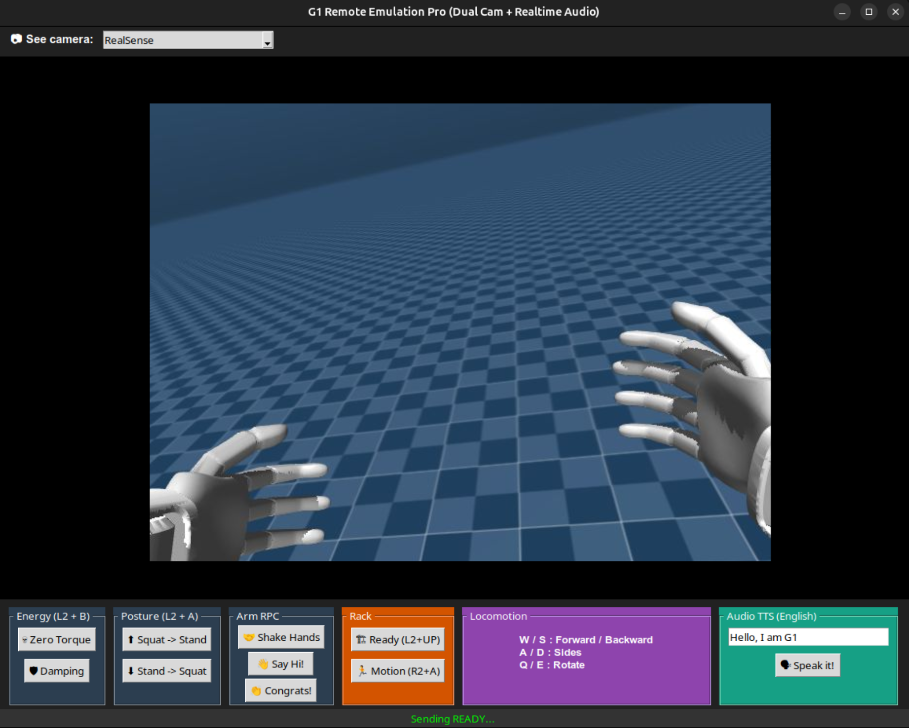

# Unitree G1 Remote Camera Client

This directory contains a client-server architecture (`g1_client.py` and `g1_server.py`) for connecting to and monitoring the camera and audio streams of a Unitree G1 over a local network.



## System Overview
1. **Server (`g1_server.py`):** Runs on the Unitree G1 robot. Captures frames from the RealSense camera and a secondary USB webcam, compresses them, and broadcasts them via ZeroMQ (ZMQ).
2. **Client (`g1_client.py`):** Runs on your local machine. Subscribes to the ZMQ streams and renders the video in a Tkinter GUI. Features a Text-To-Speech (TTS) panel for audio playback on the robot.

## Prerequisites

Install the required dependencies on your **local machine**:

```bash
sudo apt-get install libportaudio2
pip install pyzmq opencv-python Pillow numpy sounddevice
```

## Step-by-Step Usage

1. **Start the Server on the Robot**
Ensure the Unitree G1 is powered on and connected to your local network.
Note: If using an external USB camera, ensure it is plugged in before booting the robot.

SSH into the robot (replace <ROBOT_IP> with the actual IP, e.g., 192.168.1.126):

```bash
ssh unitree@<ROBOT_IP>
```

Once inside the robot, navigate to this directory and run the server:

```bash
python3 g1_server.py
```

2. **Start the Client Locally**
On your local workstation, open a new terminal, navigate to the camera directory, and run:

```bash
# Ensure you edit g1_client.py to match the robot's IP before running
python3 g1_client.py
```

Use the dropdown menu at the top of the interface to switch between the RealSense camera (Port 6001) and the USB Camera (Port 6002).

## Locomotion and Safety Note
The interface includes buttons for locomotion (Zero Torque, Damping, Squat, Stand). Always follow the correct state machine transitions. To use custom programmed arm movements, the robot must be placed in Rack mode. Ensure the area around the robot is clear before triggering any locomotion commands.

## On Simulation
To use the Mujoco Simulation instead of the physical robot, please read the [Mujoco instructions](../mujoco/README.md).

## Emotion Recognition & Robot Reaction (AI Integration)

This module integrates a multimodal Deep Learning model (Audio + Vision) to detect human emotions and trigger specific robot animations or inverse kinematics (IK) movements. This was developed in collaboration with the Korean research team.

### Files Overview
* **`model.py` & `inference.py`**: Contains the PyTorch architecture (`AVFusionModel`). It extracts audio features using Wav2Vec2 and visual features using a Swin Transformer + BiGRU, fusing them via Cross-Attention to predict among 6 emotion classes.
* **`controller.py`**: The main execution script for the **physical robot**. It captures face crops via `insightface` and audio via ZMQ, runs inference every few seconds, and triggers `G1ArmActionClient` prefabricated actions based on the detected emotion.
* **`emotions_g1_mujoco.py`**: The counterpart for the **MuJoCo simulation**. Instead of relying on internal robot macros, it uses Pinocchio-based Forward/Inverse Kinematics with Null-Space Projection to procedurally generate smooth arm animations corresponding to specific emotions (Happy, Sad, Angry, etc.).

### Prerequisites for Emotion Inference
To run the AI models and the IK solver, you need to install additional heavy dependencies on your local machine:

```bash
# Install Deep Learning and Vision dependencies
pip install torch torchvision torchaudio timm transformers insightface onnxruntime

# Install Pinocchio for Inverse Kinematics (Simulation script)
conda install pinocchio -c conda-forge
```

Note: You must also have the pre-trained weights file (e.g., best_epoch17_val0.5943.pth) located in this directory for the inference to work.

### Execution

1. **On the Physical Robot**
Ensure the g1_server.py is running on the robot (see the camera server steps above). Then, run the emotion controller locally:

```bash
python3 controller.py
```

The system will automatically look for faces, listen to the audio buffer, predict the emotion, and send the corresponding movement commands to the robot.

2. **In the MuJoCo Simulation**
If you're testing in simulation, first run the simulation (more on [Mujoco instructions](../mujoco/README.md)), and then run the interactive IK emotion script:

```bash
python3 emotions_g1_mujoco.py
```

Once the IK engine syncs with the simulation state, you can manually type an emotion (e.g., HAPPY, ANGRY, FRUSTRATED) in the terminal to see the procedural arm movements executed in real-time in the simulator.
