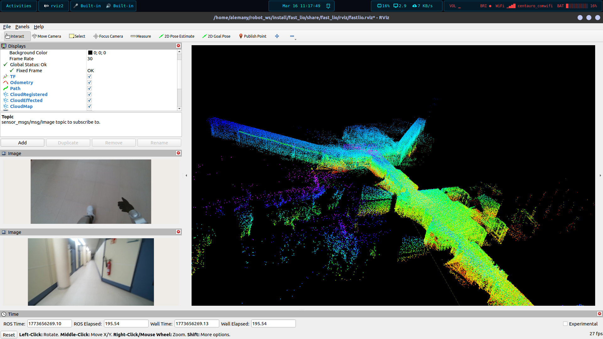

# Unitree G1 Humanoid - FastLIO2 & Sensor Logging

## Overview
This directory contains the scripts and instructions to record a complete multimodal dataset (LiDAR, IMU, and dual cameras) on the Unitree G1, and subsequently run the FastLIO2 algorithm on a local workstation to generate a 3D pointcloud.



## Architecture: The PC1 to PC2 Bridge
The Unitree G1's internal architecture relies on two computers. **PC1** handles low-level hardware and raw sensor streams (such as the Livox LiDAR and internal RealSense) but is generally inaccessible to the user. **PC2** is the user-accessible computer. 

To run standard ROS 2 SLAM algorithms like FastLIO, we need to bridge these isolated streams into standard ROS 2 topics. The scripts in this folder act as that bridge:

* **`lidar_relay.py`**: Subscribes to the internal Unitree Livox topics (`/utlidar/...`) and republishes them to standard Livox topics (`/livox/lidar`, `/livox/imu`). It optimizes the QoS for high-frequency traffic and forces the `livox_frame` frame_id to ensure TF trees work properly in RViz and FastLIO.
* **`sdk_camera_ros.py`**: Interfaces directly with the Unitree SDK2 to pull frames from the internal RealSense camera. It publishes them as a ROS 2 `CompressedImage` topic (`/camera/image/compressed`) at a stable ~18 FPS to avoid node freezing.
* **`webcam_pub.py`**: A generic ROS 2 publisher for an external USB webcam (set to `/dev/video6`). It uses OpenCV to compress and publish the stream. This script is standard and can be used on any robot or computer setup.

## Step-by-Step Guide

### 1. Run the Sensor Relays (On the Robot - PC2)
SSH into the robot's PC2 and launch the necessary scripts. You can run these in separate terminals or using a terminal multiplexer like `tmux`.

```bash
# Ensure ROS 2 Humble and Unitree SDK are sourced
source /opt/ros/humble/setup.bash

# Terminal 1: Run the Lidar/IMU relay
python3 lidar_relay.py

# Terminal 2: Run the RealSense SDK camera bridge
python3 sdk_camera_ros.py

# Terminal 3 (Optional): If using the external USB webcam
python3 webcam_pub.py
```

Stop the recording with Ctrl+C when you finish walking the robot around your environment. Transfer the generated g1_mapping_session folder to your local PC via scp or a USB drive.

3. **Run FastLIO2 (On your Local PC)**
With the rosbag on your local machine, you can now generate the pointcloud. Note: Ensure you have compiled a ROS 2 port of FastLIO (e.g., fast_lio) in your local workspace.

Terminal 1: Launch FastLIO2

```bash
# Source your local workspace where fast_lio is installed
source install/setup.bash

# Launch the mapping node (using the standard MID360 configuration)
ros2 launch fast_lio mapping.launch.py config_file:=mid360.yaml
```

Terminal 2: Play the Bag
Open another terminal, navigate to where you saved the rosbag, and play it:
```bash
source /opt/ros/humble/setup.bash
ros2 bag play g1_mapping_session/
```

You should now see the 3D map building in real-time in RViz!
