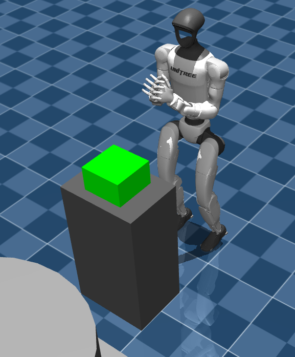
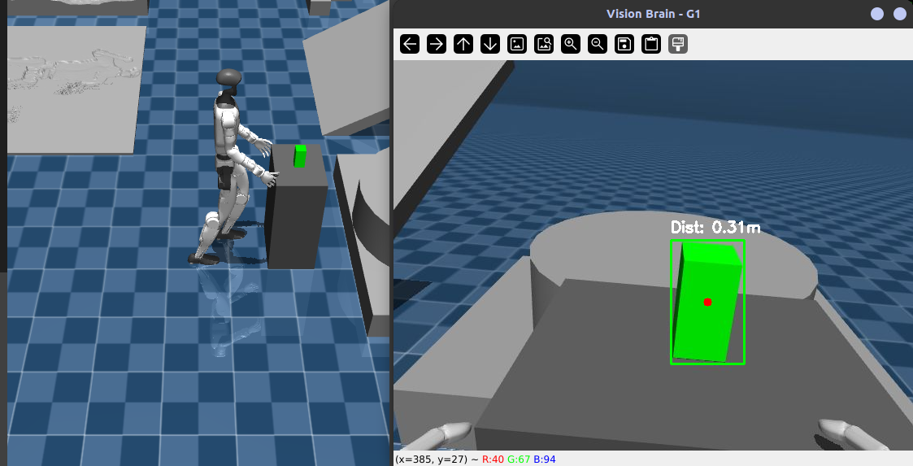
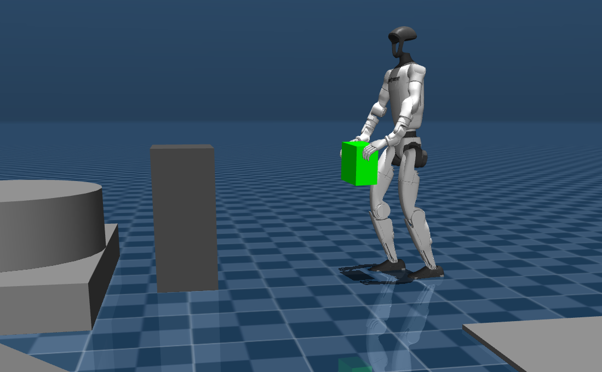

# Unitree G1 Humanoid - Manipulation Workspace

## Overview
This workspace contains a suite of tools and controllers dedicated to the upper-body manipulation of the Unitree G1 humanoid robot. It includes advanced scripts for Inverse Kinematics (IK) with Collision Avoidance, safe operational volume mapping, and an autonomous vision-based grasping pipeline. 

The logic provided here is designed to work both on the **physical robot** (via ROS 2) and in the **MuJoCo simulation** (via Unitree SDK2 DDS).


## Prerequisites and Installation

To run these manipulation scripts, you need a specific set of mathematical and computer vision libraries. 

1. **Install Python Dependencies:**
```bash
pip install numpy opencv-python pyzmq
```

2. **Install Pinocchio (Kinematics Engine):**
Pinocchio is required for the Forward/Inverse kinematics calculations and Jacobian matrix operations.

```bash
sudo apt install ros-humble-pinocchio
```

Note: Ensure you have sourced your ROS 2 environment (source /opt/ros/humble/setup.bash) before running the python scripts, otherwise Python will return a ModuleNotFoundError.

## Workspace Execution Guide
1. **Generating the Safety Workspace**
Before running the IK controllers on the physical robot, it is highly recommended to define a safe operational bounding box to prevent the robot from hitting itself.

```bash
# Run the mapper and move the left arm around
python3 workspace_mapper.py
```
This will generate a left_arm_safe_zone.json file. The IK scripts automatically load this file to clamp target coordinates.

2. **Running Inverse Kinematics (MuJoCo Simulation)**
The simulation IK script (inverse_kinematics_mujoco.py) connects to the simulated robot using the Unitree SDK2. It features a "Mirror Mode" where the right arm automatically mirrors the movements of the left arm.



First, ensure the MuJoCo simulation is running (see [Mujoco instructions](../mujoco/README.md)).

Run the IK controller:

```bash
python3 inverse_kinematics_mujoco.py
```

Type the desired Cartesian coordinates X, Y, Z in the terminal to watch the arms move procedurally. Type s to release the arm control.

3. **Running Inverse Kinematics (Physical Robot)**
The physical robot script (inverse_kinematics_collision_avoidance.py) uses standard ROS 2 nodes to communicate. It implements Null-Space Projection to actively repel the joints from their mechanical limits (e.g., keeping the elbow from over-extending) while still reaching the target.

Ensure the ROS 2 workspace is sourced.

Run the node:

```bash
python3 inverse_kinematics_collision_avoidance.py
```

Input the desired X, Y, Z coordinates. The terminal will warn you if the target is outside the safe zone and will automatically intersect the trajectory to keep the robot safe.

4. **Autonomous Vision-Based Grabbing (vision_brain.py)**
This is the master integration script. It uses a ZMQ camera stream and color thresholding (HSV) to detect a bright green box, calculates its spatial 3D coordinates, commands the robot to walk towards it, aligns its arms, and executes a grabbing sequence.




## Architecture Requirements:

- Camera Stream: Must be publishing to tcp://127.0.0.1:5555.

- Locomotion Node: Must be listening to TCP port 6000 to receive w, a, s, d, stop commands.

- Arm Controller: The script sends UDP joint commands to 127.0.0.1:9876.

## Execution

Ensure your simulation/hardware bridges are running on the required ports, then execute:

```bash
# This still only works on mujoco, will work on a real robot in a near future
python3 vision_brain.py
```

A computer vision window will pop up showing the detection bounding box and estimated distance. The state machine will automatically transition from BUSCANDO (Searching) -> ACERCANDO (Approaching) -> ALINEAR (Aligning) -> AGARRAR (Grabbing).

## Core File Structure

- inverse_kinematics_collision_avoidance.py: Advanced Cartesian controller for the physical robot (ROS 2).

- inverse_kinematics_mujoco.py: Cartesian controller for the MuJoCo simulator (SDK2 DDS).

- vision_brain.py: Standalone state-machine for visual servoing and autonomous grabbing.

- workspace_mapper.py: Utility to generate the physical limits configuration file.

- left_arm_safe_zone.json: Generated JSON containing x_min, x_max, etc.

- motor_mapping.py / read_coords.py: Diagnostic tools for joint identification and physical calibration.

## Video Demonstration


Sorry, the real video demonstration:


