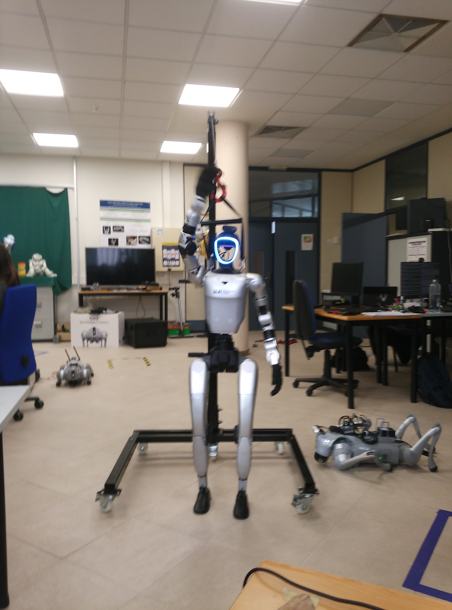

# Unitree G1 Humanoid - Manipulation Workspace

## Overview
This workspace contains a suite of tools and controllers dedicated to the upper-body manipulation of the Unitree G1 humanoid robot. It includes scripts for Forward and Inverse Kinematics (FK/IK), safety workspace mapping, manual motor testing, and computer vision integration. While currently focused on physical robot deployment, the logic is designed to be extensible to simulation environments.

## File Structure

### Core Kinematics
- g1_kinematics.py: The primary mathematical engine. It utilizes Pinocchio for robot model wrapping and Casadi for symbolic optimization. It provides the base class for calculating joint targets based on end-effector poses.
- inverse_kinematics.py: A standard Cartesian controller that allows the user to input X, Y, Z coordinates to move the left arm using a damped least-squares Jacobian approach.
- inverse_kinematics_collision_avoidance.py: An advanced version of the IK controller. It utilizes Null-Space Projection to perform secondary tasks, such as pushing joints away from their physical limits while maintaining the primary reaching goal.

### Workspace and Safety
- workspace_mapper.py: A utility script used to define safe operational volumes. It records the extreme positions of the hand while the user moves the arm manually, saving the results to a configuration file.
- left_arm_safe_zone.json: A JSON file containing the X, Y, Z bounding box limits generated by the workspace mapper. This is used by the IK scripts to clamp target coordinates.
- read_coords.py: A diagnostic tool that prints the real-time Cartesian coordinates of the hand by processing motor feedback through a Forward Kinematics model.

### Testing and Vision
- motor_mapping.py: An interactive terminal tool to move specific motors (12 through 28) to precise angles. Used for joint identification and physical calibration.
- example_movement.py: A basic ROS 2 node that demonstrates arm control by sending a sine-wave trajectory to the shoulder pitch.
- box_detector.py: A vision-based detection script using YOLOv8. It is designed to receive video frames via ZMQ and identify objects like bottles to provide targets for the manipulation scripts (Status: Development in progress).

## Requirements
- Python 3.12
- Pinocchio (Robot kinematics library)
- Casadi (Optimization framework)
- Ultralytics (YOLOv8 support)
- PyZMQ and OpenCV (For vision streaming)
- Unitree HG ROS 2 messages

## Configuration and Setup
- URDF Path: Most scripts point to a local URDF file located in the g1pilot description directory. Ensure the path in the __init__ methods matches your local system.
- Network: Scripts are configured to communicate over ROS 2 topics. For physical hardware, ensure the correct network interface is sourced.
- Motor Indexing: This workspace assumes a G1 configuration with 7-DOF arms. Motor indices 15-21 represent the left arm, and 22-28 represent the right arm.

## Operational Notes
- Safety Switch: Command scripts utilize motor index 29 as a control switch (weight factor). Setting this to 1.0 requests arm control from the robot's main controller; setting it to 0.0 releases control.
- Workspace Clamping: The inverse_kinematics_collision_avoidance.py script automatically intercepts targets outside the safe zone and uses ray-casting to find the nearest valid point within the defined JSON boundaries.

## Future Development
- Simulation Integration: Adaptation of Domain IDs and interface settings to allow seamless switching between the physical robot and the MuJoCo simulator.
- Vision-to-Action: Linking the box_detector.py output directly to the IK controllers for automated pick-and-place tasks.
- Dual-Arm Coordination: Expanding the reduced model logic to support simultaneous IK for both left and right arms.
