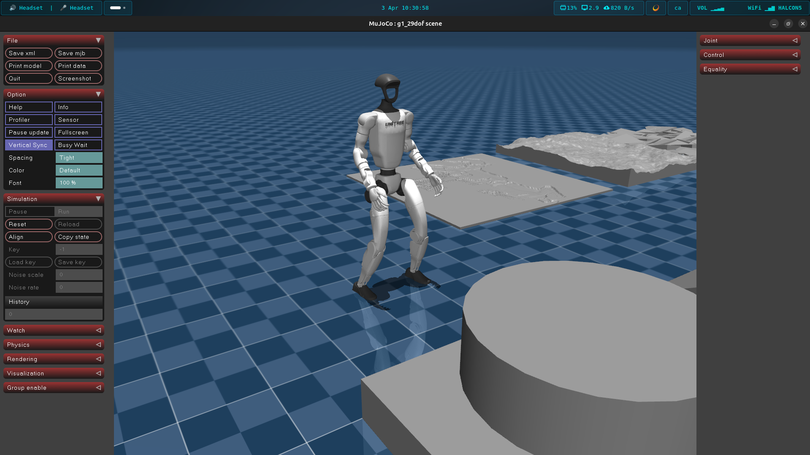

# Unitree G1 Humanoid - MuJoCo Simulation Environment

## Overview
This directory provides a complete, isolated simulation environment for the Unitree G1 humanoid robot. It bridges the **MuJoCo physics engine** with the **Unitree SDK2**, allowing you to test locomotion, manipulation, and computer vision pipelines safely before deploying them to the physical hardware.

The simulation includes a pre-trained Reinforcement Learning (RL) model (`fastsac_g1_29dof.onnx`) that actively stabilizes the robot and handles lower-body locomotion (walking, squatting, standing).



## Prerequisites

Before running the simulation, ensure you have installed the necessary Python packages:

```bash
# Core simulation, AI inference, and vision tools
pip install mujoco onnxruntime pyzmq opencv-python numpy
```

Note: You must also have the unitree_sdk2py library correctly installed and sourced in your Python environment.

## Important: Network & DDS Configuration
To prevent the simulated robot's data from interfering with the physical robot on the same network, this simulation is strictly configured to use the local loopback interface (127.0.0.1) and DDS Domain 1.

- Do not change this to Domain 0 unless you are entirely disconnected from the physical robot's network.

- The proportional gains (Kp) for the hip roll actuators have been specifically tuned in this environment to properly support the torso's weight in MuJoCo.

## Step-by-Step Execution Guide
To get the full simulated experience, you will need to open multiple terminals.

1. **Launch the Core Simulation**
This script initializes the MuJoCo physics, starts the Unitree SDK2 bridge, and loads the ONNX RL policy to keep the robot balanced.

```bash
python3 run_sim_ai_g1.py
```

Leave this running in the background. The robot should spawn and stand up.

2. **View the Robot's Camera (Optional)**
The simulation bridge includes a VisionServerThread that broadcasts the robot's chest-mounted RealSense camera perspective via ZeroMQ. To view it, open a new terminal and run:

```bash
python3 vision.py
```

3. **Teleoperation (Walking)**
To move the robot around the virtual environment using your keyboard (WASD + QE), use the generic camera client located in the camera workspace. Open a new terminal:

```bash
cd ../camera
python3 g1_client_mujoco.py
```

4. Arm Manipulation & Emotions
The RL policy controls the legs and waist, but the arms are left free for your commands. You can run the Inverse Kinematics scripts to interact with the simulated environment:

```bash
cd ../manipulation
# Run the interactive IK solver for MuJoCo
python3 inverse_kinematics_mujoco.py
```
```bash
# OR run the procedural emotion animations
python3 emotions_g1_mujoco.py
```

## Directory Structure
- run_sim_ai_g1.py: Master launcher for physics and the AI locomotion policy.

- fastsac_g1_29dof.onnx: Pre-trained neural network weights for 29-DOF G1 locomotion.

- vision.py: ZMQ subscriber client to display the simulated RealSense feed.

- simulator/: Contains the core bridge components.

	- unitree_mujoco.py: The main bridge translating MuJoCo physics into Unitree SDK2 structures.

	- config.py: Hardcoded configuration for 127.0.0.1 and Domain 1.

	- scene.xml / g1_29dof.xml: The MuJoCo XML files defining the environment, lighting, collision geometries, and robot joints.

	- meshes/: Visual and collision STL files for the robot.
