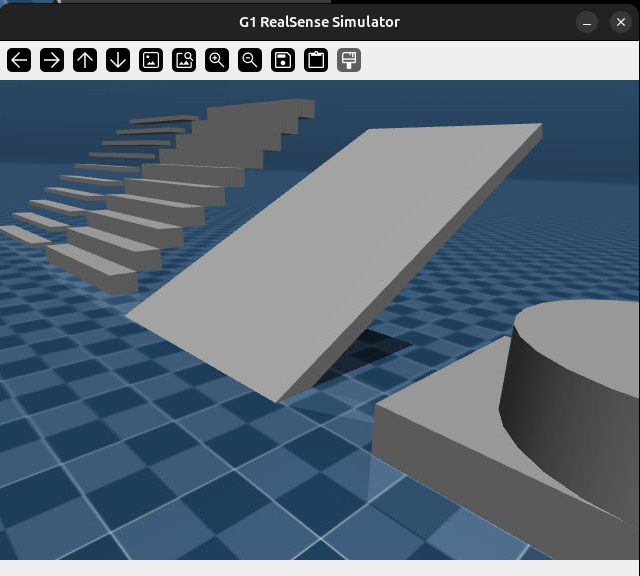

# Unitree G1 Humanoid - MuJoCo Simulation

## Overview
Here is provided a complete environment for simulating the Unitree G1 humanoid robot using MuJoCo and the Unitree SDK2. It integrates a Reinforcement Learning model for stable locomotion and a vision server for real-time camera feedback.

## File Structure
- run_sim_ai_g1.py: The entry point script. It initializes the DDS communication on Domain 1, launches the physical simulation and the AI controller simultaneously using subprocess management and waits for arm controls and movement speed.

- fastsac_g1_29dof.onnx: The pre-trained neural network model for G1 locomotion (29 degrees of freedom).
- vision.py: A ZMQ-based client designed to receive and display the torso-mounted RealSense camera stream.

- g1_actions.py: Contains auxiliary definitions for robot poses and specific action mappings used by the controller (which are obsolete, now we should work with the scripts at manipulation subdirectory).
- simulator/: Directory containing core simulation assets and the physics engine bridge.
  - unitree_mujoco.py: The bridge script between the MuJoCo engine and Unitree SDK2 protocols. It includes the VisionServerThread for image streaming.
  - config.py: Central configuration for robot selection, network interface (set to loopback), and domain IDs.
  - scene.xml: The main MuJoCo scene defining the environment, lighting, and floor physics.
  - g1_29dof.xml: The MJCF model for the G1 robot, defining actuators, sensors, and collision geometries.
  - meshes/: Directory containing STL files for the robot's physical components.

## Requirements
The system requires the following dependencies: mujoco, onnxruntime, rclpy, pyzmq, opencv-python, and numpy. The unitree_sdk2py library must be correctly installed and linked in the python environment.

## Execution Steps
1. Simulation and Control: Launch the master script by executing python3 run_sim_ai_g1.py.
2. Vision Stream: To view the live feed from the robot's perspective, run python3 vision.py in a separate terminal.
3. Teleoperation and Vision: run the client from ../camera/g1_client_mujoco.py to move with WASD+QE and see it in real time.
4. Manipulation: use scripts from ../manipulation/*_mujoco.py to do the desired tasks.

## Physics and Network Configuration
- Network: The system is configured to use the local loopback interface (127.0.0.1) and DDS Domain 1 to ensure zero interference with physical robot hardware on the same network.
- Stability: Proportional gains (Kp) for the hip roll actuators are increased to support torso weight effectively during the walking cycle.

## Manipulation Development
Work in progress...

## Demonstrative video

This gif is intended to me seen as a joke, as it is configured right now, this should not happen.
